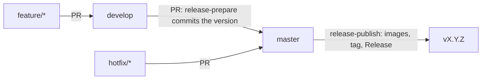

# js-ci-runner

Hardened, non-root container images for JavaScript and TypeScript CI. Your repositories run their GitHub Actions job steps in the **CI image**. Your apps ship on the **runtime image**.

| Image | Base | User | Use it for |
|---|---|---|---|
| `ghcr.io/yi-john-huang/js-ci-runner/ci` | `node:24-alpine` | `runner` (UID 1001) | GitHub Actions job containers and build stages |
| `ghcr.io/yi-john-huang/js-ci-runner/runtime` | `gcr.io/distroless/nodejs24-debian13:nonroot` | `nonroot` (UID 65532) | The final stage of an app image |

## Use the CI image in a workflow

```yaml
jobs:
  test:
    runs-on: ubuntu-latest
    container: ghcr.io/yi-john-huang/js-ci-runner/ci:0.1.0
    steps:
      - uses: actions/checkout@v4
      - run: npm ci
      - run: npm test
```

Replace `0.0.0` with a released version. You can also pin `:0.1` to get patch updates, or `:0` to get minor updates. The `:develop` tag follows the `develop` branch and can change at any time.

The image contains Node.js 24, npm, corepack (for pnpm and Yarn), bash, git, tar, gzip, zstd, ssh, jq, and curl.

## Ship an app on the runtime image

```dockerfile
FROM ghcr.io/yi-john-huang/js-ci-runner/ci:0.1.0 AS build
WORKDIR /home/runner/app
COPY --chown=1001:1001 . .
RUN npm ci && npm run build && npm prune --omit=dev

FROM ghcr.io/yi-john-huang/js-ci-runner/runtime:0.1.0
WORKDIR /app
COPY --from=build /home/runner/app/dist ./dist
COPY --from=build /home/runner/app/node_modules ./node_modules
CMD ["dist/server.js"]
```

The runtime image starts `node` directly. `CMD` takes the script path. [examples/hello-app](examples/hello-app) has a complete example.

## Security properties

- **Non-root.** Both images run as a non-root user. The CI image user cannot install packages.
- **No shell at runtime.** The runtime image is distroless. It has no shell and no package manager.
- **Pinned bases.** Each Dockerfile pins its base image by digest. Dependabot opens a pull request when a base image changes.
- **Scanned.** CI fails on a fixable critical vulnerability and reports fixable high ones.
- **Signed, with an SBOM and provenance.** Each release image has a keyless cosign signature, an SBOM, and build provenance.

To check a signature:

```bash
cosign verify ghcr.io/yi-john-huang/js-ci-runner/ci:0.1.0 \
  --certificate-identity-regexp '^https://github.com/yi-john-huang/js-ci-runner/.github/workflows/release-publish.yml@' \
  --certificate-oidc-issuer https://token.actions.githubusercontent.com
```

## Limits and trade-offs

No single base fits every role. Each image uses the base that is supported for its job.

| Choice | What you gain | What you pay |
|---|---|---|
| Alpine for CI | A small image with a shell and the tools that actions need | Alpine uses musl. A rare npm package with native code can fail to build. |
| Distroless for runtime | No shell or package manager for an attacker to use | You cannot `docker exec` a shell into it. Debug with a separate image. |
| UID 1001 for the CI user | `actions/checkout` can write the workspace on GitHub-hosted Ubuntu runners | On a self-hosted runner with a different UID, set `container.options: --user <uid>` |

Two more limits:

- GitHub supports JavaScript actions in Alpine job containers only on **x64** runners. The CI image is published for arm64 too, but use it as a job container on x64 runners.
- The CI image is not a self-hosted runner. It runs the steps of a job. GitHub-hosted runners start it.

## Branches and releases (Gitflow)



| Branch | What CI does |
|---|---|
| `feature/*` → `develop` pull request | Lints, builds, smoke-tests, and scans both images |
| Push to `develop` | Publishes `:develop` and `:sha-<commit>`, then runs the CI image as a real job container |
| `develop` → `master` pull request | Plans the next version and commits it to `develop` |
| Push to `master` | Publishes `:X.Y.Z`, `:X.Y`, `:X`, and `:latest` for amd64 and arm64, signs them, and creates the tag and Release |

The version comes from Conventional Commits since the last tag: a breaking change means major, `feat` means minor, and anything else means patch. A `release:patch`, `release:minor`, or `release:major` label on the release pull request overrides it. See [CONTRIBUTING.md](CONTRIBUTING.md) for the branch rules.

## Credentials

| Credential | Service | Used for |
|---|---|---|
| `RELEASE_TOKEN` secret | GitHub | `release-prepare.yml` pushes the bump commit to the protected `develop` branch. Nothing else uses it. |
| `GITHUB_TOKEN` | GitHub and GHCR | Publishing images, creating the tag and Release. Actions provides it on each run. |
| GitHub OIDC | Sigstore | Keyless image signing. No key is stored. |

## One-time setup

```bash
scripts/setup-repo.sh
```

The script makes `develop` the default branch and creates the release labels. It stores `RELEASE_TOKEN` from a hidden prompt. It can also protect `master` and `develop`. After the first push to `develop`, make the two GHCR packages public if other repositories should pull them.

## License

MIT. See [LICENSE](LICENSE).
